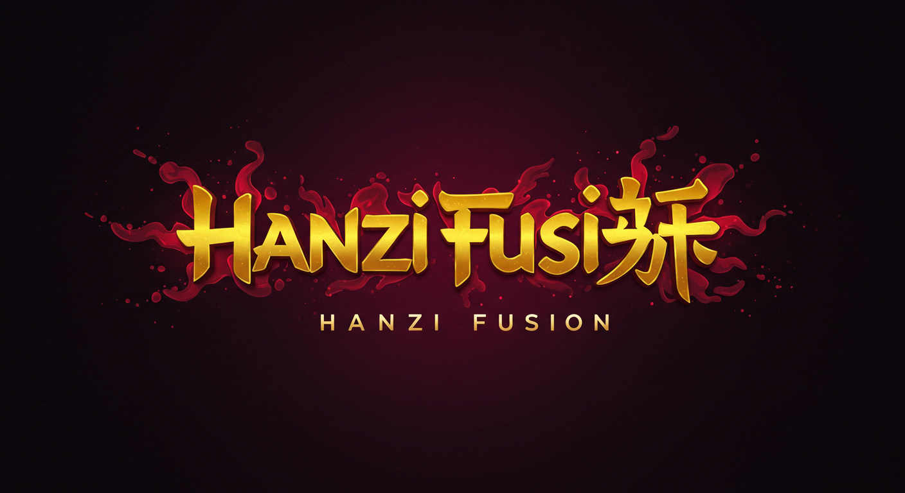

# Hanzi Fusion: The Chinese Character Crafting Game



**A captivating mobile game where you combine Chinese characters to discover new ones, inspired by classics like *Little Alchemy* and *Infinite Craft*. Built with Flutter and Flame.**


[](https://flutter.dev)
[](https://github.com/cbarkinozer/hanzi_fusion)
[](https://github.com/cbarkinozer/hanzi_fusion)

---

## 📖 Table of Contents

-   [🎯 Project Overview](#-project-overview)
-   [✨ Key Features](#-key-features)
-   [🛠️ Tech Stack & Architecture](#️-tech-stack--architecture)
-   [📂 Project Structure](#-project-structure)
-   [🚀 Getting Started](#-getting-started)
-   [📊 Data Structure](#-data-structure)
-   [🗺️ Development Roadmap](#️-development-roadmap)
-   [🤔 Major Problems and Their Solutions](#-major-problems-and-their-solutions)
-   [🤝 How to Contribute](#-how-to-contribute)

---

## 🎯 Project Overview

Hanzi Fusion is a puzzle game that leverages the beautiful, component-based nature of Chinese characters (Hanzi). Players start with a handful of basic elemental characters (e.g., 木 tree, 水 water, 人 person) and combine them by dragging and dropping them together. Successful combinations, based on etymology, semantics, or phonetic clues, create new characters, which are then added to the player's inventory for further fusion.

The goal is to create an experience that is not only addictive and fun but also subtly educational, offering players a glimpse into the logic and artistry behind one of the world's oldest writing systems.

---

## ✨ Key Features

-   **Intuitive Drag & Drop Interface:** Simple and satisfying core mechanic.
-   **Expansive Discovery System:** Hundreds of characters to discover, from simple pictographs to complex ideograms.
-   **Local Progress Saving:** Your discoveries are automatically saved to your device.
-   **Cross-Platform:** Built with Flutter for a native experience on both Android and iOS from a single codebase.
-   **(In Progress) Audio Feedback:** Sound effects for successful and failed fusions.
-   **(Planned) Discovery Book:** An in-game encyclopedia that tracks all discovered characters, showing their pinyin (pronunciation), meaning, and a short etymology.
-   **(Planned) Hint System:** A non-intrusive system to help players when they get stuck.

---

## 🛠️ Tech Stack & Architecture

This project is built using the Flutter framework, chosen for its high-performance, cross-platform capabilities and excellent developer experience.

-   **Framework:** [**Flutter**](https://flutter.dev/)
-   **Language:** [**Dart**](https://dart.dev/)
-   **Game/Rendering Logic:** [**Flame Engine**](https://flame-engine.org/) - A minimalist 2D game engine for Flutter that's perfect for handling the game canvas, sprites, and drag-and-drop gestures.
-   **State Management:** [**Riverpod**](https://riverpod.dev/) - For clean, robust, and scalable state management, separating UI from business logic (e.g., managing the list of discovered characters).
-   **Local Storage:** [**shared_preferences**](https://pub.dev/packages/shared_preferences) - For persisting the player's list of discovered character IDs locally.
-   **Audio:** [**flame_audio**](https://pub.dev/packages/flame_audio) - For playing sound effects for game events.
-   **Data Source:** `JSON` files stored in the app's assets for all character and recipe data. This allows for easy updates and management.

---

## 📂 Project Structure

The project follows a standard feature-first folder structure to maintain separation of concerns.

```
📂 hanzi_fusion
├── 📁 android
│   ├── 📁 app
│   │   ├── 📁 src
│   │   │   ├── 📁 debug
│   │   │   │   └── 📄 AndroidManifest.xml
│   │   │   ├── 📁 main
│   │   │   │   ├── 📁 kotlin
│   │   │   │   │   └── 📁 com
│   │   │   │   │       └── 📁 example
│   │   │   │   │           └── 📁 hanzi_fusion
│   │   │   │   │               └── 📄 MainActivity.kt
│   │   │   │   ├── 📁 res
│   │   │   │   │   ├── 📁 drawable
│   │   │   │   │   │   └── 📄 launch_background.xml
│   │   │   │   │   ├── 📁 drawable-v21
│   │   │   │   │   │   └── 📄 launch_background.xml
│   │   │   │   │   ├── 📁 mipmap-hdpi
│   │   │   │   │   ├── 📁 mipmap-mdpi
│   │   │   │   │   ├── 📁 mipmap-xhdpi
│   │   │   │   │   ├── 📁 mipmap-xxhdpi
│   │   │   │   │   ├── 📁 mipmap-xxxhdpi
│   │   │   │   │   ├── 📁 values
│   │   │   │   │   │   └── 📄 styles.xml
│   │   │   │   │   └── 📁 values-night
│   │   │   │   │       └── 📄 styles.xml
│   │   │   │   └── 📄 AndroidManifest.xml
│   │   │   └── 📁 profile
│   │   │       └── 📄 AndroidManifest.xml
│   │   └── 📄 build.gradle.kts
│   ├── 📁 gradle
│   │   └── 📁 wrapper
│   │       └── 📄 gradle-wrapper.properties
│   ├── 📄 .gitignore
│   ├── 📄 build.gradle.kts
│   ├── 📄 gradle.properties
│   └── 📄 settings.gradle.kts
├── 📁 assets
│   ├── 📁 audio
│   ├── 📁 data
│   │   ├── 📄 characters.json
│   │   └── 📄 recipes.json
│   └── 📁 fonts
├── 📁 data_preperation_scripts
│   ├── 📄 deduplicate_and_verify.py
│   └── 📄 recipe_generator.py
├── 📁 ios
│   ├── 📁 Flutter
│   ├── 📁 Runner
│   │   ├── 📁 Assets.xcassets
│   │   │   ├── 📁 AppIcon.appiconset
│   │   │   │   ├── 📄 Contents.json
│   │   │   └── 📁 LaunchImage.imageset
│   │   │       ├── 📄 Contents.json
│   │   │       └── 📄 README.md
│   │   ├── 📁 Base.lproj
│   │   ├── 📄 AppDelegate.swift
│   │   └── 📄 Runner-Bridging-Header.h
│   ├── 📁 Runner.xcodeproj
│   │   ├── 📁 project.xcworkspace
│   │   │   ├── 📁 xcshareddata
│   │   ├── 📁 xcshareddata
│   │   │   └── 📁 xcschemes
│   ├── 📁 Runner.xcworkspace
│   │   ├── 📁 xcshareddata
│   ├── 📁 RunnerTests
│   │   └── 📄 RunnerTests.swift
│   └── 📄 .gitignore
├── 📁 lib
│   ├── 📁 data
│   │   ├── 📁 models
│   │   │   ├── 📄 character_model.dart
│   │   │   ├── 📄 character_model.g.dart
│   │   │   ├── 📄 discovery_model.dart
│   │   │   ├── 📄 level_model.dart
│   │   │   ├── 📄 player_progress_model.dart
│   │   │   ├── 📄 player_progress_model.freezed.dart
│   │   │   ├── 📄 player_progress_model.g.dart
│   │   │   ├── 📄 recipe_model.dart
│   │   │   └── 📄 recipe_model.g.dart
│   │   ├── 📄 game_data_repository.dart
│   │   ├── 📄 game_data_repository.g.dart
│   │   └── 📄 hsk_data.dart
│   ├── 📁 game
│   │   ├── 📁 components
│   │   │   ├── 📄 character_component.dart
│   │   │   └── 📄 hanzi_text_component.dart
│   │   ├── 📁 effects
│   │   │   └── 📄 shake_effect.dart
│   │   └── 📄 hanzi_fusion_game.dart
│   ├── 📁 providers
│   │   ├── 📄 game_event_provider.dart
│   │   ├── 📄 level_provider.dart
│   │   ├── 📄 level_provider.g.dart
│   │   ├── 📄 player_progress_provider.dart
│   │   ├── 📄 player_progress_provider.g.dart
│   │   ├── 📄 settings_provider.dart
│   │   ├── 📄 settings_provider.g.dart
│   │   ├── 📄 theme_provider.dart
│   │   ├── 📄 theme_provider.g.dart
│   │   └── 📄 tts_provider.dart
│   ├── 📁 ui
│   │   ├── 📁 screens
│   │   │   ├── 📄 characters_screen.dart
│   │   │   ├── 📄 game_page.dart
│   │   │   ├── 📄 game_screen.dart
│   │   │   ├── 📄 recipes_screen.dart
│   │   │   └── 📄 settings_screen.dart
│   │   └── 📁 widgets
│   │       ├── 📄 inventory_panel.dart
│   │       └── 📄 new_discovery_animation.dart
│   └── 📄 main.dart
├── 📁 linux
│   ├── 📁 flutter
│   │   ├── 📄 CMakeLists.txt
│   │   ├── 📄 generated_plugin_registrant.cc
│   │   ├── 📄 generated_plugin_registrant.h
│   │   └── 📄 generated_plugins.cmake
│   ├── 📁 runner
│   │   ├── 📄 CMakeLists.txt
│   │   ├── 📄 main.cc
│   │   ├── 📄 my_application.cc
│   │   └── 📄 my_application.h
│   ├── 📄 .gitignore
│   └── 📄 CMakeLists.txt
├── 📁 macos
│   ├── 📁 Flutter
│   │   └── 📄 GeneratedPluginRegistrant.swift
│   ├── 📁 Runner
│   │   ├── 📁 Assets.xcassets
│   │   │   └── 📁 AppIcon.appiconset
│   │   │       └── 📄 Contents.json
│   │   ├── 📁 Base.lproj
│   │   ├── 📁 Configs
│   │   ├── 📄 AppDelegate.swift
│   │   ├── 📄 MainFlutterWindow.swift
│   ├── 📁 Runner.xcodeproj
│   │   ├── 📁 project.xcworkspace
│   │   │   └── 📁 xcshareddata
│   │   ├── 📁 xcshareddata
│   │   │   └── 📁 xcschemes
│   ├── 📁 Runner.xcworkspace
│   │   ├── 📁 xcshareddata
│   ├── 📁 RunnerTests
│   │   └── 📄 RunnerTests.swift
│   └── 📄 .gitignore
├── 📁 test
│   └── 📄 widget_test.dart
├── 📁 web
│   ├── 📁 icons
│   ├── 📄 index.html
│   └── 📄 manifest.json
├── 📁 windows
│   ├── 📁 flutter
│   │   ├── 📄 CMakeLists.txt
│   │   ├── 📄 generated_plugin_registrant.cc
│   │   ├── 📄 generated_plugin_registrant.h
│   │   └── 📄 generated_plugins.cmake
│   ├── 📁 runner
│   │   ├── 📁 resources
│   │   ├── 📄 CMakeLists.txt
│   │   ├── 📄 flutter_window.cpp
│   │   ├── 📄 flutter_window.h
│   │   ├── 📄 main.cpp
│   │   ├── 📄 resource.h
│   │   ├── 📄 utils.cpp
│   │   ├── 📄 utils.h
│   │   ├── 📄 win32_window.cpp
│   │   └── 📄 win32_window.h
│   ├── 📄 .gitignore
│   └── 📄 CMakeLists.txt
├── 📄 .gitignore
├── 📄 analysis_options.yaml
├── 📄 pubspec.yaml
└── 📄 README.md
```

---

## 🚀 Getting Started

Follow these instructions to get the project running on your local machine for development and testing.

### Prerequisites

-   [Flutter SDK](https://docs.flutter.dev/get-started/install) (version 3.x or higher)
-   An IDE like [VS Code](https://code.visualstudio.com/) or [Android Studio](https://developer.android.com/studio)
-   An Android emulator or physical device

### Installation

1.  **Clone the repository:**
    ```sh
    git clone https://github.com/cbarkinozer/hanzi_fusion.git
    cd hanzi-fusion
    ```
2.  **Install dependencies:**
    ```sh
    flutter pub get
    ```
3.  **Ensure assets are registered:**
    Open `pubspec.yaml` and make sure the `assets/data/` directory is included under the `flutter:` section.
    ```yaml
    flutter:
      uses-material-design: true
      assets:
        - assets/data/
        # - assets/fonts/   # Add when custom fonts are included
        # - assets/audio/   # Add when sound effects are included
    ```
4.  **Run the code generator:**
    The project uses code generation for models and providers. Run this command to generate the necessary files:
    ```sh
    dart run build_runner watch
    ```
5.  **Run the app:**
    ```sh
    flutter run
    ```

---

## 📊 Data Structure

The game's content is driven by two key JSON files.

### `characters.json`

An array of all characters in the game. Each character has a unique ID, the character itself, pinyin, and meaning.

```json
[
  {
    "id": 10,
    "char": "人",
    "pinyin": "rén",
    "meaning": "person"
  },
  {
    "id": 123,
    "char": "木",
    "pinyin": "mù",
    "meaning": "wood/tree"
  },
  {
    "id": 130,
    "char": "休",
    "pinyin": "xiū",
    "meaning": "rest"
  }
]
```

### `recipes.json`

An array defining all valid combinations. It uses the actual characters as inputs, making it easy for anyone to contribute new recipes without needing to look up IDs. The application intelligently converts these into a more performant, ID-based format at runtime.

```json
[
  {
    "inputs": ["人", "木"],
    "output": "休"
  },
  {
    "inputs": ["日", "月"],
    "output": "明"
  },
  {
    "inputs": ["木", "木"],
    "output": "林"
  }
]
```

## 🗺️ Development Roadmap

The project is broken down into key milestones. `✅` = Done, `🚧` = In Progress, `⬜` = To-Do.

### ✅ Milestone 1: Core Engine & UI Foundation

The basic gameplay loop and navigation are functional. Players can discover new characters, progress is saved locally, and they can browse their discoveries.

-   [x] Setup Flutter project with Flame and Riverpod.
-   [x] Implement data loading from `characters.json` and `recipes.json`.
-   [x] Create the basic game screen with an inventory panel and a fusion area.
-   [x] Implement drag-and-drop for character components using Flame.
-   [x] Write the core combination logic to check recipes on drag-and-drop.
-   [x] Implement local progress saving/loading using `shared_preferences`.
-   [x] Create the "Characters" and "Recipes" discovery pages.
-   [x] Implement an HSK-based level system for progression.

### 🚧 Milestone 2: UI/UX & Polish

This milestone focuses on creating a polished and satisfying user experience.

-   [✅] **Integrate sound effects** for key events (drag start, fusion success/fail, UI clicks, level up).
-   [✅] **Add satisfying animations** for successful (e.g., particle burst) and failed (e.g., shake) fusions.
-   [✅] **Implement the New Discovery Popup** showing `A + B = C` with an animation.
-   [✅] **Integrate on-device Text-to-Speech** for pinyin pronunciation on the Character page and Discovery Popup.
-   [⬜] **Implement Dynamic Theming:** Change the app's color scheme based on the current HSK level.
-   [⬜] **Build the Settings Screen** with options for sound, music, and resetting progress.
-   [⬜] Add settings button to the game screen.

### ⬜ Milestone 3: Content & Gameplay Expansion

This milestone focuses on deepening the educational content and expanding the gameplay.

-   [x] **Expand character and recipe data** to over 200+ discoveries.
-   [⬜] **Implement a Hint System** based on a combination of time and unique failed attempts.
-   [⬜] **Balance the discovery path** to ensure smooth progression and avoid getting stuck (prepare recipe paths to be sure). Same recipe found again should not trigger animation.
-   [⬜] **Expand `characters.json` with etymological data** for a richer "Discovery Book" experience.

### ⬜ Milestone 4: Deployment & Advanced Features

-   [ ] Prepare and publish the app to the Google Play Store.
-   [ ] Prepare and publish the app to the Apple App Store.
-   [ ] (Stretch Goal) Investigate Firebase integration for cloud sync.
-   [ ] (Stretch Goal) Investigate deploying a web version using Flutter for Web.

---

# Paths (Spoiler)
Paths need to be studied (in order) to be sure the player never gets stuck.

### HSK 0
4149: 丶 initial
4143:丨 initial
131: 一 initial
丶 + 丶 = 丷
丨 + 丶 = 丿
一 + 丶 = ㇏
一 + 一 = 27: 二
一 + 丨 = 94: 十
十 + 一 = 732: 干
丷 + 干 = 半
㇏ + 丿 = 人
丨 + ㇏  = 4216:"亻",
人 + 亻 163:"从",
丨 + 人 31:"个",
人 + ㇏ = 4329 入
亻 + 十 = 4217 什
㇏ + 一 6327:"𠂉",
十 + 𠂉 4450:"午
午 + 𠂉 = 75 年
二 + 一 = 三
二 + 丨 = 4349 匚
匚 +  丶 = 冂
匚 + 匚 = 4818:"己"
匚 + 一 442:"口",
口 + 丨 = 4146 中
丿 + 丿 = 2: 八
𠂉 + 丨 =  4144:"丩",
口 + 丩 = 46:"叫",
口 + 丷 = 586:"只",
八 + 人 =  4222:"介",
丿 + 一 = 4180:"乚",
丿 + 乚 = 4314:"儿",
口 + 儿 = 103:"四",
冂 + 儿 = 4319:"兄",
兄 + 丷 = 4296:"兑",
𠂉 + 丶 = 6056:"讠",
讠 + 兑 = 5991:"说",
讠 + 十 = 5957:"计",
讠 + 人 = 5959:"认",
讠 + 只 = 5976:"识",
乚 + 丨 = 4086:"㇉",
㇉ + 口 = 459:"马",
马 + 口 = 61:"吗",
吗 + 口 = 1864:"骂",
乚 + 乚 = 2322:"乙",
乙 + 𠂉 = 4182:"乞",
口 + 乞 = 11:"吃",
乞 + 一 = 4950:"气",
丷 + 丶 = 4360:"冫",
乚 + 冫 = 6274:"飞",
冫 + 兄 = 4363:"况",
口 + 口 = 87:"日",
日 + 丨 = 433:"旧",
日 + 一 = 5153:"旦",
旦 + 亻 = 4260:"但",
旦 + 丨 = 5155:"早",
日 + 口 = 4567:"唱",
乚 + 日 = 5516:"电",
乚 + 一 = 79:"七",
七 + 亻 = 4439:"化",
丶 + 口 = 152:"白",
白 + 一 = 153:"百",
㇏ + 丶 = 4085:"㇇",
㇇ + 人 = 4221:"今",
十 + ㇏ = 235:"千",
舌 + 口 = 5831:"舌",
舌 + 讠 = 5982:"话",
冫+ 丶 = 5312:"氵",
氵 + 舌 = 5361:"活",
舌 + 乚 = 885:"乱",
氵+ 气 = 5325:"汽",
𠂉 + 一 =4084:"㇆",
㇆ + 口 = 137:"月",
㇆ + 日 = 571:"用", 
月 + 月 = 5199:"朋", 
月 + 半 = 480:"胖",
月 +  日 =  5163:"明",
𠂉 + ㇆ = 4431:"勹",
㇆ + 丶 = 4183:"习",
𠂉 + 丶 = 4072:"⺈",
勹 + 口 = 4503:"句",
勹 + 丶= 4432:"勺",
勺 + 白 = 15:"的",
丿 + 丨 = 4187:"亅",
亅 +  𠂉 = 55:"了",
了 + 一 = 4714:"子",
勺 + 丨 = 4758:"寸",
寸 + 日 =  5518:"时",
讠 + 一 = 6101:"辶",
辶 + 寸 = 188:"过",
寸 + 亻 = 4229:"付",
讠 + 寸 = 5961:"讨",
寸 + 丶 = 327:"才",
才 + 一 = 5462:"牙",
㇏ + 丶 = 4464:"卜",
卜 + 一 = 116:"下",
十 + 亅 = 90:"上",
下 + 口 = 2224:"吓",
口 + 十 = 4465:"占",
丷 + 丷 = 5421:"灬",
口 + 灬 = 16:"点",
日 + 日 = 5565:"目",
目 + 丶 = 5824:"自",
百 + 口 = 6250:"面",
干 + 上 = 5284:"止",
止 +  讠 = 238:"让",
上 + 上 = 4466:"卡",
止 + 一 = 2409:"正",
正 + 日 = 96:"是",
才 + 白 = 6073:"身",
身 + 讠 = 6006:"谢",
卜 + 丶 = 4878:"弋",
弋 + 亻 = 4230:"代",
弋 +  = 5003:"戈",
千 + 一 = 5019:"手",
弋 + 丨 = 5022:"扌",
扌 + 弋 = 112:"我",
十 + 人 = 5206:"木",
木 + 一 = 6:"本",
戈 + 口 = 5010:"或",
目 + 手 = 50:"看",
扌 + 旦 = 5054:"担",
扌 + 自 = 1912:"拍",
扌 + 弋 = 291:"找",
扌 + 是 = 是
本 + 亻= 4261:"体",
十 + 木 = 5207:"末",
木 + 丷 = 465:"米",
米 + 十 = 53:"来",
口 + 木 = 1389:"呆",
木 + 亻= 4243:"休",
木 + 丶 = 5616:"禾",
禾 + 口 = 37:"和",
禾 + 中 = 589:"种",
木 + 日 = 1062:"香",
目 + 木 = 5567:"相",
香 + 上 = 5255:"桌",
㇆ + 丿 = 43:"几",
几 + 木 = 1651:"机",
乚  + 丷 = 4918:"心",
丨 + 丷 = 4919:"忄",
心 + 相 = 121:"想",
心 + 白 = 4958:"息",
心 + 只 = 4949:"总",
忄 + 白 = 4935:"怕",
536-392=136+8=144
### HSK1
### HSK2 
### HSK3
### HSK4
### HSK5
### HSK6

---

## 🤔 Major Problems and Their Solutions

This section documents key design decisions and the reasoning behind them.

### 1. The Challenge: Character Complexity vs. Usage Frequency (HSK)

**The Problem:** The most logically simple characters to build (e.g., `林`, `森`) are not always the most useful words for a beginner to learn (e.g., `电影`, `我`, `是`). A game that only follows etymology might feel impractical.

**The Solution: A Tiered Discovery System.**

The game's progression is designed in tiers, starting with etymologically simple characters to teach the *principle* of Hanzi construction, and then expanding to include more common vocabulary (HSK words) as the player builds their inventory of components.

*   **Tier 0: Primitives:** The starting elements (`人`, `木`, `水`, etc.).
*   **Tier 1: Etymological Foundation:** The early game focuses on intuitive combinations like `人 + 木 = 休` (rest). This is the "magic" that hooks the player.
*   **Tier 2: Vocabulary Building:** The mid-game introduces recipes for common words like `电 + 话 = 电话` (telephone), using the components discovered in Tier 1.

### 2. The Challenge: Folk Etymologies vs. Academic Rigor

**The Problem:** Many easy-to-remember stories for characters are not historically accurate. Should the game use the "fun but false" story or the "correct but complex" one?

**The Solution: Separate the Mechanic from the Explanation.**

*   **The Crafting Logic (The Mechanic): Prioritize Fun and Memorability.** The recipes in `recipes.json` are designed to be intuitive and create a memorable mental hook, even if they are based on folk etymology. The goal of the game loop is engagement.
*   **The Discovery Panel (The Explanation): Provide Accurate Information.** When a character is discovered (a feature planned for Milestone 2), the info panel will provide the accurate etymology, separating the fun mnemonic from the real linguistic details.

### 3. The Challenge: Semantic vs. Phonetic Components

**The Problem:** A single component like `马 (mǎ)` can give meaning (in `驾`) or sound (in `妈`). How do you teach this without a confusing lecture?

**The Solution: Implicit Learning Through UI and Pattern Recognition.**

Instead of complex rules, the game will guide the user with subtle UI cues.

*   **On Combination:** When a character is formed, an animation can highlight which component provided the meaning (e.g., glows blue) and which provided the sound (e.g., glows green).
*   **The "Aha!" Moment:** After making a few characters with the same phonetic component (like `妈`, `骂`, `吗`), the player will discover the pattern for themselves, which is a far more powerful and rewarding learning experience than being told the rule upfront.

## 🤝 How to Contribute

Contributions are welcome! If you have ideas for new features, bug fixes, or new character recipes, please follow these steps:

1.  **Fork** the repository.
2.  Create a new **branch** (`git checkout -b feature/your-feature-name`).
3.  Make your changes. (Adding new recipes to `assets/data/recipes.json` is a great way to start!)
4.  Commit your changes (`git commit -m 'Add some feature'`).
5.  Push to the branch (`git push origin feature/your-feature-name`).
6.  Open a **Pull Request**.